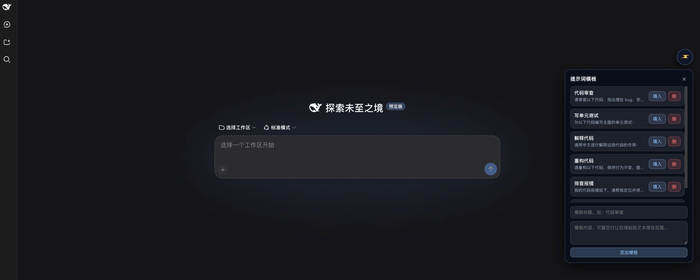

# dsh-prompt-presets · 提示词模板库 + 任务完成提醒

DeepSeek Harness (DSH) Web GUI 的小工具插件：右下角悬浮「⚡」打开提示词模板库（一键填入输入框、可增删模板）；agent 任务完成/出错时页面右上角弹 toast，同时发 macOS / Linux 系统原生通知。不修改任何 DSH 源码，卸载即完全还原。

## 界面预览

<p align="center">
  
</p>

## 功能

- **提示词模板库**：内置 6 个常用模板（代码审查 / 写单元测试 / 解释代码 / 重构 / 排查报错 / Commit 信息），支持添加、删除、一键填入输入框。
- **任务完成提醒**：宿主半区订阅 `agent/status`（`running → idle`）与 `agent/error`，完成/出错事件写入内存环形缓冲，前端每 2.5s 轮询 `/dsh-toolbox/events` 弹 toast；宿主同时调用 `osascript`（macOS）/ `notify-send`（Linux）发系统通知。

## 安装

```sh
dsh plugin --profile web add link:/Users/apple/Desktop/dash-web/dsh-prompt-presets
dsh web   # 重启 DSH 生效
```

打开 `dsh web` 页面，右下角出现「⚡」按钮即安装成功。

## 使用

- 点「⚡」展开/收起模板面板；点模板行「填入」把模板内容填进当前会话输入框。
- 面板底部可添加自定义模板；行内「删」按钮删除。
- agent 跑任务时切到后台再切回来，任务结束会看到右上角 toast 和系统通知。

## 数据存放

- 模板持久化在 `~/.dsh/dsh-toolbox.json`，可手动编辑（重启后生效）。
- 可用环境变量 `DSH_TOOLBOX_DATA_DIR` 指定其他目录。
- 提示：macOS 系统通知需要 `osascript`（系统自带）；Linux 需要 `notify-send`（`libnotify`），缺失时自动跳过、只保留页面 toast。

## 已知限制

- `agent/status` 包含子 agent 的状态切换，理论上子任务结束也会提醒；已对同一会话做 1s 防抖。
- 事件缓冲在内存中（最多 30 条），`dsh web` 重启后清空；前端只在页面打开时轮询。
- 页面 toast 依赖页面存活；系统通知不受页面影响。

## 开发

- 源码即产物，直接改 `bundle/host.js`（宿主，ESM）与 `bundle/client.js`（浏览器，`window.__ModuleLoader__.load` 格式），改完重启 `dsh web` 生效。
- `link:` 安装指向本目录，改动无需重装。
- 卸载：`dsh plugin --profile web remove dsh-prompt-presets`，重启后页面完全还原。
